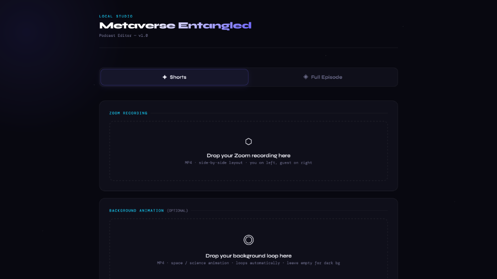

# Metaverse Entangled — Podcast Editor

A professional-grade, local-first web studio and command-line podcast editing tool designed specifically for side-by-side Zoom recordings. Render landscape full episodes with dynamic background loops, or slice vertical 9:16 portrait shorts (reels/TikToks) with stacked speaker views and caption space.

---

## 🌌 Local Studio Web Interface

The editor features a beautiful, futuristic, starfield dark-themed UI that processes everything locally on your machine—ensuring maximum privacy and near-zero latency.



---

## ✨ Features

- **✦ Portrait Shorts Mode (9:16 Reels/TikToks)**
  - Automatically slices custom timestamps from your Zoom recording.
  - Stacks the speaker (right panel) on top and the host (left panel) on the bottom.
  - Leaves an elegant center gap reserved for captions.
  - Fallback to sleek dark (#0d0d0d) background or upload a custom loop.
  - Outputs a ready-to-publish vertical `1080x1920` video.

- **◈ Landscape Full Episode Mode (16:9)**
  - Places host and guest side-by-side in custom square panels (`880x880`).
  - Seamlessly blends panels over a looping, blurred, and slightly darkened background animation.
  - Automatically stretches or loops the background video to fit the exact duration of the main episode.
  - Renders a high-quality `1920x1080` master copy.

---

## 🛠️ Tech Stack & Prerequisites

- **Backend**: FastAPI, Uvicorn, Python Multipart
- **Frontend**: Vanilla HTML5, CSS3 (with Custom Properties & Starfield Animations), modern Javascript (XHR with uploads progress)
- **Processing**: FFmpeg & FFprobe (used for cropping, scaling, compositing, and duration calculations)

### Prerequisites

You must have `ffmpeg` and `ffprobe` installed on your machine and available in your system path.

#### On macOS:
```bash
brew install ffmpeg
```

#### On Linux:
```bash
sudo apt update
sudo apt install ffmpeg
```

---

## 🚀 Setup & Installation

1. **Clone the repository:**
   ```bash
   git clone https://github.com/yourusername/podcast-editor.git
   cd podcast-editor
   ```

2. **Set up a virtual environment (optional but recommended):**
   ```bash
   python3 -m venv venv
   source venv/bin/activate
   ```

3. **Install the dependencies:**
   ```bash
   pip install -r requirements.txt
   ```

---

## 🖥️ How to Run

### Option 1: Start the Local Studio Web App (Recommended)

Run the FastAPI server. It will automatically boot up and launch the web app in your default browser:

```bash
python app.py
```

Open your browser and navigate to `http://localhost:8000`.

- **To Export Shorts:** Upload a Zoom recording, add segment timeframes (e.g. `02:15` to `03:45`), optionally write a caption, and click **Export Shorts**.
- **To Export Full Episode:** Upload your Zoom recording and a background loop, then click **Export Full Episode**.
- Files will be downloaded directly as a `.zip` (for multiple shorts) or `.mp4` (for a full episode).

---

### Option 2: Use the Command-Line Interface (CLI)

The CLI tool `podcast_editor.py` allows rapid headless processing.

#### 1. Generate Portrait Shorts
Generate multiple portrait clips by passing comma-separated time segments:
```bash
python podcast_editor.py --mode shorts --input zoom_recording.mp4 --segments 02:15-03:45,10:00-11:30
```

#### 2. Generate Full Landscape Episode
Combine the side-by-side Zoom recording with an animated background:
```bash
python podcast_editor.py --mode full --input zoom_recording.mp4 --bg background_loop.mp4
```

Outputs will be saved automatically into the `./output/` directory.

---

## 📐 How It Works (FFmpeg Processing Pipeline)

Under the hood, `podcast_editor.py` uses high-performance FFmpeg filter complexes to manipulate video layouts:

### Stacked Portrait Shorts (9:16)
1. **Crop**: Slices the source video (`1280x720`) in half to isolate the left panel (host) and right panel (guest).
2. **Scale**: Resizes each panel to `1080x880` to fill the width of a standard `1080x1920` phone screen.
3. **Composite**: Places the speaker panel at `y=0` (top), the host panel at `y=1040` (bottom), leaving a `160px` gap at `y=880` for custom captions.

### Side-by-Side Episode (16:9)
1. **Loop Background**: Stretches the background animation infinitely to fit the main track.
2. **Crop & Scale**: Crops the host and speaker into matching `880x880` square frames.
3. **Composite**: Overlays both panels side-by-side with a `160px` margin between them, centered vertically against the looping, slightly blurred background canvas.

---

🛡️ *Note: All processing happens 100% locally on your machine. None of your media files are sent to external servers.*
